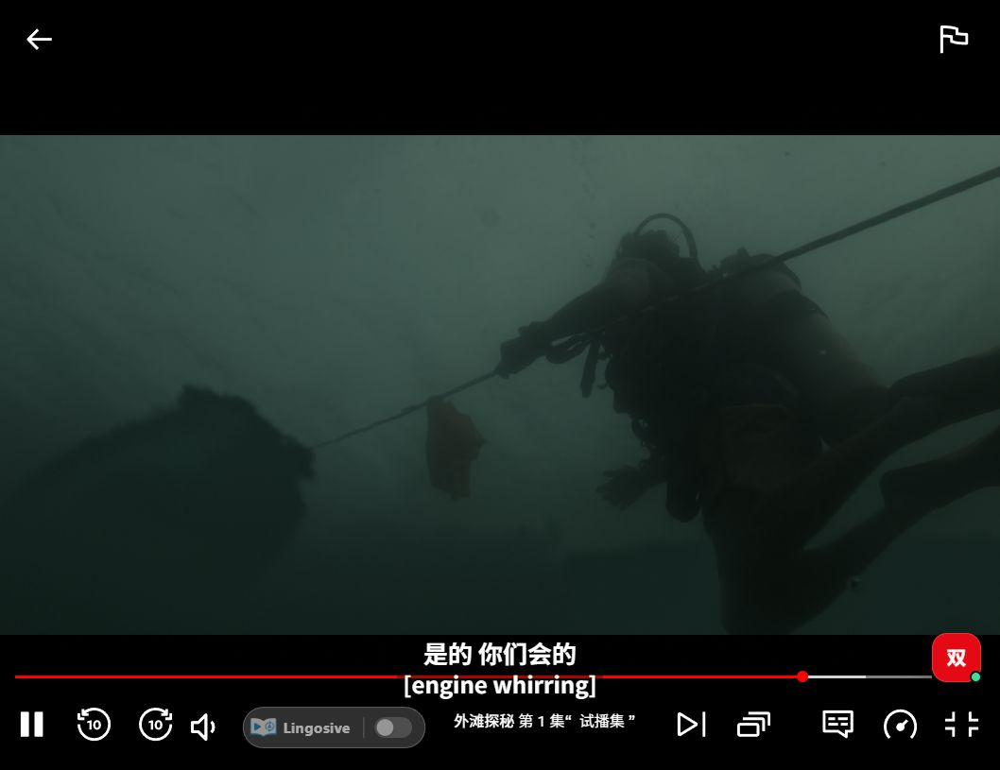
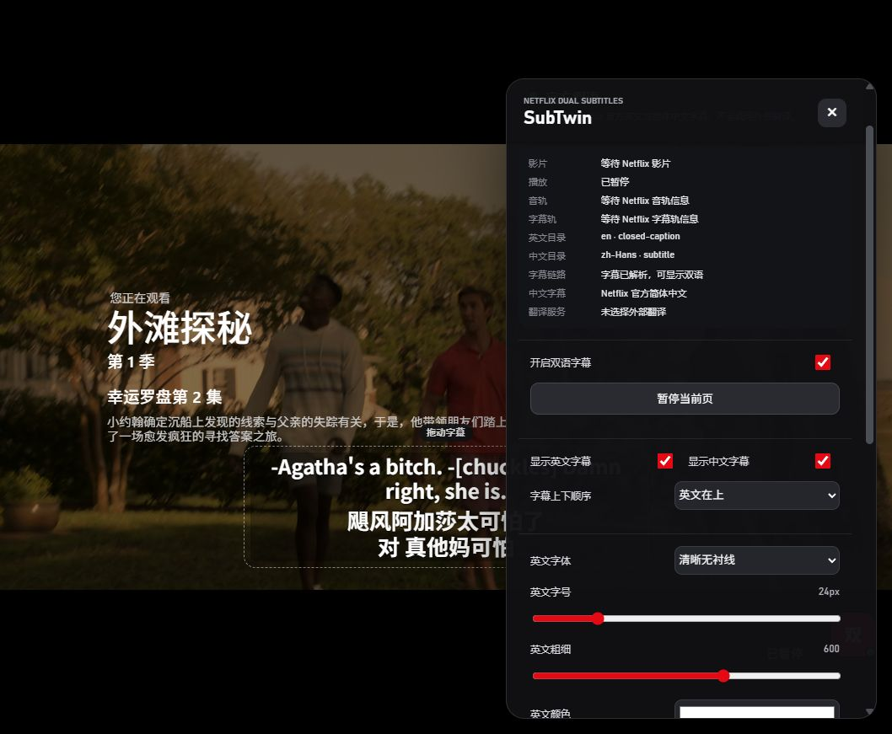

<div align="center">

# SubTwin

### Netflix 网页端的可控英中双语字幕

在 Netflix 原生字幕、Google 翻译和 DeepSeek 翻译之间明确选择，
并直接在播放页调整字幕布局、字体、颜色与位置。

[](https://github.com/chasen2041maker/SubTwin/actions/workflows/ci.yml)
[](https://github.com/chasen2041maker/SubTwin/releases/latest)
[](https://github.com/chasen2041maker/SubTwin/releases)


[下载最新版本](https://github.com/chasen2041maker/SubTwin/releases/latest) ·
[查看更新记录](CHANGELOG.md) ·
[手工验证指南](docs/manual-verification.md)

</div>



## 为什么使用 SubTwin

Netflix 的字幕语言、地区版权和片源并不总能满足双语学习需求。SubTwin 在不替换播放器的前提下，把字幕选择、翻译和样式控制放回播放页面：选择哪个来源，就严格使用哪个来源；开启双语时，Netflix 原字幕作为可靠英文源保留在底层，但不会与自定义双语字幕重复显示。

| 能力 | 说明 |
| --- | --- |
| 三种字幕来源 | Netflix 原生双语、Google 翻译、DeepSeek 上下文翻译 |
| 播放页控制台 | 可拖拽的“双”按钮，展开后直接切换来源、暂停或启用扩展 |
| 完整样式控制 | 中英文显示、上下顺序、字体、字号、粗细、颜色、阴影、行距、单行长度、垂直位置、背景透明度 |
| 字幕直接拖动 | 控制台打开时可上下拖动字幕，松开后自动保存位置 |
| 同步双行渲染 | 翻译完成前不闪单行英文；完成后中英同时出现 |
| 稳定播放时钟 | 以 Netflix 页面实际字幕为主，避免时间轴偏差造成字幕闪烁或提前消失 |
| 代际任务隔离 | 切换剧集、来源或播放器时取消旧任务，迟到结果不能污染当前字幕 |
| 本地设置与缓存 | 设置存于 `chrome.storage.local`，翻译缓存存于后台 IndexedDB |

## 安装

SubTwin 尚未发布到 Chrome Web Store。请从 GitHub Releases 安装经过 CI 验证的构建：

1. 打开 [最新 Release](https://github.com/chasen2041maker/SubTwin/releases/latest)。
2. 下载 `subtwin-<version>-chrome-mv3.zip`，可用同页的 `SHA256SUMS.txt` 校验文件。
3. 解压 ZIP。
4. 在 Chrome 打开 `chrome://extensions`，启用右上角“开发者模式”。
5. 点击“加载已解压的扩展程序”，选择解压后的目录。
6. 打开扩展选项页配置字幕来源；DeepSeek 模式需要使用你自己的 API Key。
7. 登录 Netflix，播放带英文字幕的影片，点击右下角红色“双”按钮。

> 支持范围：Netflix 桌面网页端、英文源字幕、简体中文目标字幕、Chrome 111+ 或兼容的 Chromium 浏览器。

## 播放页控制台



控制台修改会先作用于当前字幕层，再通过严格校验的 content-to-background 消息自动保存。控制台关闭后，字幕层恢复鼠标穿透，不会挡住 Netflix 的播放操作。

## 字幕来源

SubTwin 不会在来源之间偷偷降级或自动切换。

| 选择 | 行为 | 外部请求 |
| --- | --- | --- |
| Netflix 原生双语 | 解析官方英文与简体中文轨道并按时间对齐；缺少中文时保留可用原字幕 | 0 |
| Google 翻译 | 逐条翻译 Netflix 英文字幕；不会自动改用 DeepSeek | 只调用 Google |
| DeepSeek 翻译 | 使用上下文批次翻译和结果校验；不会自动改用 Google | 只调用 DeepSeek |

### Google 翻译

Google 模式使用未公开、无 SLA 的 `translate.googleapis.com/translate_a/single?client=gtx` 接口，并非 Google Cloud Translation API。它可能限流、改变格式或停止工作；原字幕位于 HTTPS GET 查询参数中，可能出现在服务方、浏览器、代理或网络诊断记录里。

### DeepSeek（BYOK）

DeepSeek 模式使用用户自己的 Key。Key 仅存放在当前浏览器配置的 `chrome.storage.local`，由扩展选项页和后台 service worker 使用；Netflix 页面只会收到“是否已配置”的布尔状态，不会收到 Key 或模型值。真实请求会消耗用户自己的 DeepSeek 额度。

## 工作原理

```text
Netflix MAIN world
  读取字幕目录与受限 timed-text 数据
             │  nonce + generation + 来源/大小校验
             ▼
Isolated content script
  字幕会话、播放时钟、页面控制台、Shadow DOM 字幕层
             │  受类型约束的扩展消息
             ▼
Background service worker
  来源门禁、翻译调度、结果校验、IndexedDB 缓存
             │
             ├── Google 翻译
             └── DeepSeek API
```

主要技术：**WXT · TypeScript · React · Manifest V3 · Vitest · IndexedDB**。

## 安全边界

- DeepSeek Key 不进入 Netflix 页面消息、源码、日志、截图或 Git 历史。
- Netflix signed timed-text URL 不持久化、不写日志，也不会跨到扩展隔离 world。
- MAIN/isolated world 桥接包含会话 nonce、generation、来源校验与 10 MiB 大小上限。
- 后台只接受当前扩展、准确 Netflix HTTPS 页面和当前会话发送的对应消息。
- 翻译缓存按剧集、字幕轨哈希、语言、服务和服务契约版本隔离，默认上限为 5,000 条或 25 MiB。
- 生产权限仅包含 `storage` 和固定主机：Netflix、DeepSeek、Google 翻译；没有宽泛来源权限。

## 本地开发

要求：Node.js 22.13+、pnpm 10+。仓库通过 `packageManager` 固定实际 pnpm 版本。

```bash
pnpm install --frozen-lockfile
pnpm dev
```

完整发布验证：

```bash
pnpm release
```

`v0.1.0` 的发布验证包含 574 项自动化测试、TypeScript 类型检查和 Chrome MV3 ZIP 构建。也可以单独运行：

```bash
pnpm test
pnpm typecheck
pnpm build
pnpm zip
```

## 项目结构

```text
entrypoints/     WXT 后台、Netflix MAIN/isolated content、popup、options
src/app/         语言路由、会话控制、状态与跨上下文任务客户端
src/netflix/     Netflix 目录、网络探针、桥接、时钟与生命周期适配
src/subtitles/   TTML/WebVTT 解析、规范化与官方字幕时间对齐
src/translation/ Google/DeepSeek、调度、验证与 IndexedDB 缓存
src/renderer/    React 页面控制台、双语字幕层与样式
src/storage/     设置 schema、迁移、权限与后台操作
tests/           单元、契约和跨模块集成测试
docs/            设计、研究、手工验证与真实页面测试证据
```

## 验证与限制

`v0.1.0` 在发布前通过 574/574 自动化测试、类型检查、生产打包以及登录态 Chrome + Netflix 实机字幕验证。测试证据保存在 [`docs/test-evidence`](docs/test-evidence)，复现步骤见[手工验证指南](docs/manual-verification.md)。

仍需注意：

- Netflix 网页结构、字幕元数据、账号地区和片源可能随时变化。
- 首次在线翻译受网络和提供商响应速度影响；DeepSeek 首次逐句翻译可能出现短暂等待。
- Google 模式依赖未公开接口，不适合作为付费产品的稳定服务承诺。
- 本项目不包含 Netflix 账号、付费、云同步或托管翻译服务，也不隶属于 Netflix、Google 或 DeepSeek。

## 文档

- [更新记录](CHANGELOG.md)
- [手工验证指南](docs/manual-verification.md)
- [MVP 设计](docs/plans/2026-08-23-subtwin-design.md)
- [实现计划](docs/plans/2026-08-23-subtwin-mvp.md)
- [Subtitle-Translate 参考项目审查](docs/research/2026-08-23-subtitle-translate-reference-review.md)

## License

本个人仓库当前未授权（`UNLICENSED`）。未经明确许可，不授予复制、修改或分发权利。
